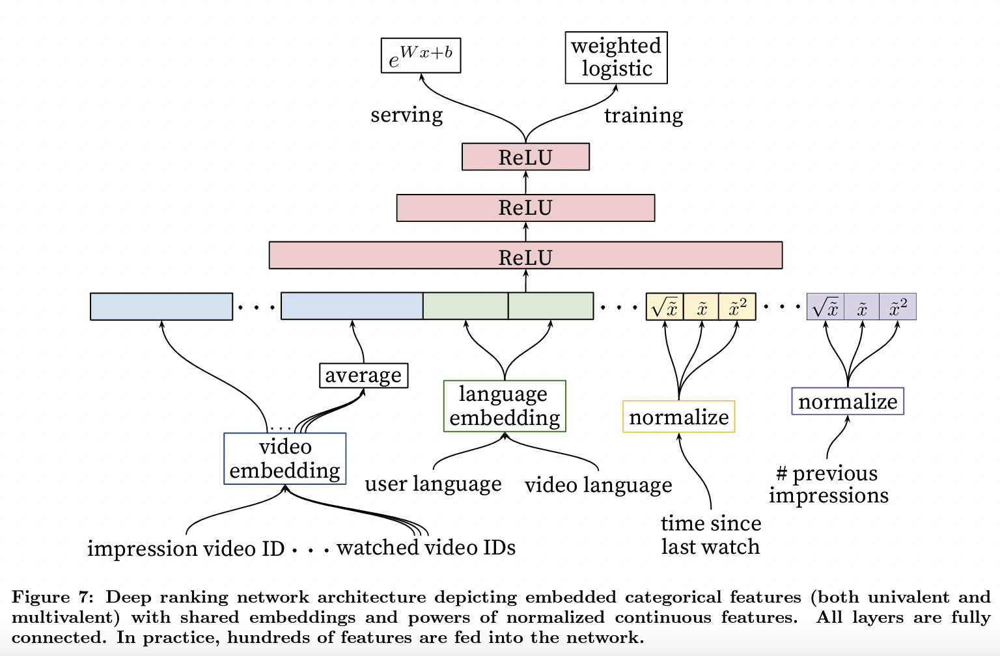
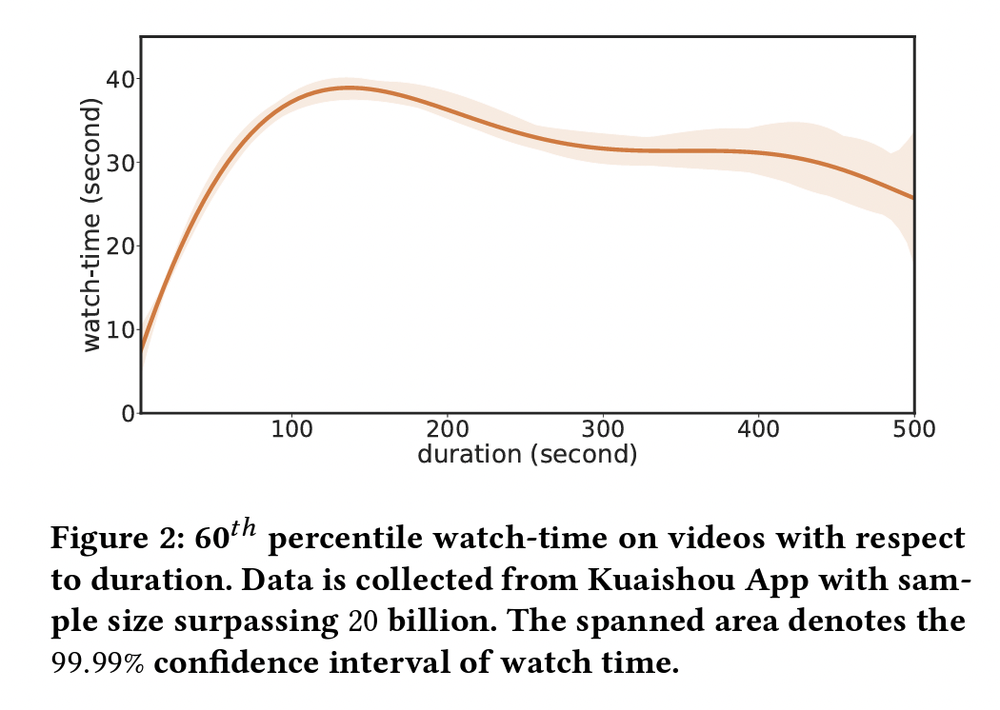
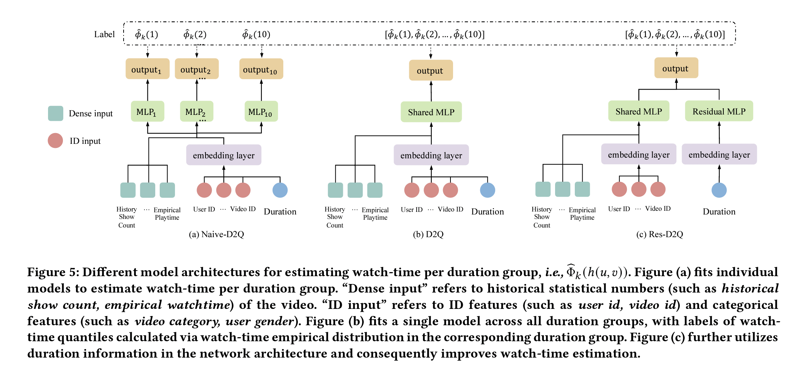
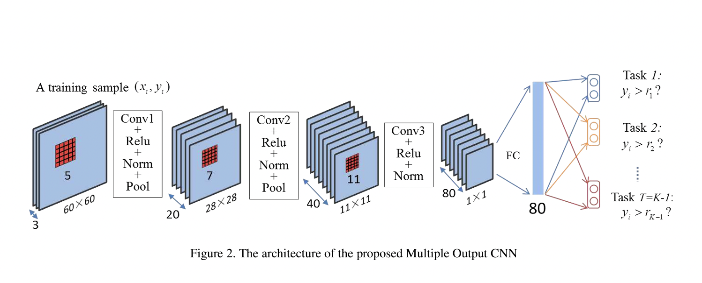
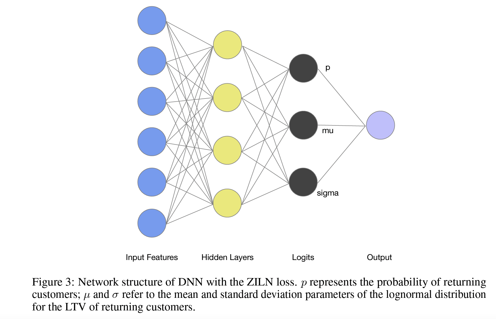

回归问题
============

MSE & MAE
-----------------

`MSE <https://en.wikipedia.org/wiki/Mean_squared_error>`_ 假设预估值 :math:`\boldsymbol{\theta}^{\top}\boldsymbol{x}` 和真实值 :math:`y` 的误差服从标准正态分布，可以推导出
:math:`p(y|\boldsymbol{x};\boldsymbol{\theta})` 是正态分布。通过最大似然估计（ `MLE <https://en.wikipedia.org/wiki/Maximum_likelihood_estimation>`_ ）可知，
最大化似然概率就是最小化 MSE Loss。

`MAE <https://en.wikipedia.org/wiki/Mean_absolute_error>`_ 的推导跟 MSE 很类似，只是假设误差服从 `拉普拉斯分布 <https://zh.wikipedia.org/wiki/%E6%8B%89%E6%99%AE%E6%8B%89%E6%96%AF%E5%88%86%E5%B8%83>`_ 。

Weighted Logistics Regression
---------------------------------------------------

`Youtube DNN <https://static.googleusercontent.com/media/research.google.com/zh-CN//pubs/archive/45530.pdf>`_ 在预估视频观看时长时，
在训练中使用交叉熵损失，然后对于正样本（有点击的样本）用实际观看时长来做加权，负样本不变。

推断时使用 :math:`e^{Wx+b}` 作为观看时长的估计（这里面假设了点击概率非常小）。

`D2Q <https://arxiv.org/pdf/2206.06003>`_
--------------------------------------------------------------------

分析指出，观看时长主要受两个因素的影响：用户是否对视频感兴趣 & 视频本身的时长。一方面，长度在 100s 以下的视频，其观看时长和本身时长正相关，将视频时长作为输入特征的观看时长预测方法会引入偏置问题；另一方面，随时间推移，视频时长分布极不均匀，且长视频曝光占比会逐渐增大，此时模型训练样本被长视频占据，用户兴趣可能无法有效建模。

D2Q 首先将数据按视频时长分组（按时长排序，等分成若干个组），然后每个分组学习回归模型去预测观看时长分位数（Watch-Time Quantiles）；推断时，将对应分组中预测的分位数映射回时长。

在实际应用中，无法为每一个分组单独预测观看时长，因为模型参数太多，效率低下；但如果在所有分组之间共享模型参数，拟合原始观看时长数值，相当于没有进行数据划分、无法消偏。因此，作者进一步提出将原始观看时长转换为视频时长相关的时长分位数标签，
这样一来，每个分组的参数是共享的，同时每个分组的学习目标的尺度也是统一的。

`Ordinal Regression <https://en.wikipedia.org/wiki/Ordinal_regression>`_
------------------------------------------------------------------------------------------------------

`OR-CNN <https://www.cv-foundation.org/openaccess/content_cvpr_2016/papers/Niu_Ordinal_Regression_With_CVPR_2016_paper.pdf>`_ 做年龄预测时，
考虑到年龄的连续性特点，用 :math:`K-1` 个二分类问题实现顺序的年龄回归。

损失函数（可以为每个分类任务设置不同的权重）：

.. math::

    \mathcal{L} = - \frac{1}{N} \sum_{i=1}^{N} \boldsymbol{y}_i \log \boldsymbol{p}_i

其中 :math:`\boldsymbol{y}_i, \boldsymbol{p}_i \in \mathbb{R}^{K-1}` ；当 :math:`\mathrm{Age}_i > r_k` ， :math:`y_i^k = 1` ，反之 :math:`y_i^k = 0` 。

预测年龄是 :math:`r_q` ， 其中 :math:`q = 1 +  \sum_{k=1}^{K-1} f(k)` ， :math:`f(k) \in \{0,1\}` 是每个分类任务的预测结果。

`ZILN <https://arxiv.org/pdf/1912.07753>`_
--------------------------------------------------------

在 LTV （Life-Time Value）预测任务中，数据往往是长尾且稀疏的，比如会有非常多的 0 值，也存在极端大的值。
MSE 无法准确地拟合 0 值，且对于极端大的值非常敏感。

ZILN（Zero-Inflated LogNormal）是一个对数正态参数估计模型，其假设 LTV 服从对数正态分布。

ZILN 需要估计三个参数： :math:`p,\mu,\sigma` ：

损失函数：

.. math::

    \mathcal{L}(x;p,\mu,\sigma) & = -\mathbb{1}_{\{x=0\}} \log (1-p) - \mathbb{1}_{\{x>0\}} (\log p - \mathcal{L}_{\mathrm{Lognormal}}(x;\mu,\sigma)) \\
                                & = \mathcal{L}_{\mathrm{CrossEntropy}}(\mathbb{1}_{\{x>0\}};p) + \mathbb{1}_{\{x>0\}} \mathcal{L}_{\mathrm{Lognormal}}(x;\mu,\sigma) \\
    \mathcal{L}_{\mathrm{Lognormal}}(x;\mu,\sigma) & =  \log (x\sigma \sqrt{2\pi}) + \frac{(\log x - \mu)^2}{2\sigma^2}                   

相比于 MSE，在预估值异常大时 :math:`\mathcal{L}_{\mathrm{Lognormal}}(x;\mu,\sigma)` 也不会非常大。

预测结果：

.. math::

    \hat{y} = p \times \mathbb{E}(x) = p \times \exp (\mu + \frac{\sigma^2}{2})

Bucketing With Softmax
----------------------------------

对 Label 的值域进行分桶，然后根据每个样本的 Label 把样本分到某个桶里，将任务转换为一个多分类问题，通过 Softmax 损失函数进行训练。

有一个问题是，Softmax 会将所有的桶平等看待。事实上，当 Label 的大小是有意义的，相邻桶之间的 Loss 应该小于不相邻桶之间的 Loss。

评估指标
------------

- MAE
- MSE
- 排序逆序对

参考资料
--------------

1. 回归任务里的损失函数

  https://zhuanlan.zhihu.com/p/627092216

2. 视频播放建模
  
  https://syf1844803351.github.io/2023/10/15/%E6%8E%92%E5%BA%8F04%EF%BC%9A%E8%A7%86%E9%A2%91%E6%92%AD%E6%94%BE%E5%BB%BA%E6%A8%A1/

3. 快手：基于因果消偏的观看时长预估模型

  https://zhuanlan.zhihu.com/p/557463255

4. LTV预估的一些思考

  https://www.cnblogs.com/zhouyc/p/16943042.html

5. 加权对数几率回归

  https://www.jianshu.com/p/463fb5513520

6. 年龄估计：Ordinal Regression

  https://blog.csdn.net/chaipp0607/article/details/90739483

7. Ordinal regression

  https://en.wikipedia.org/wiki/Ordinal_regression

8. Deconfounding Duration Bias in Watch-time Prediction for Video Recommendation

  https://arxiv.org/pdf/2206.06003

9. A Deep Probabilistic Model For Customer Lifetime Value Prediction

  https://arxiv.org/pdf/1912.07753

10. Ordinal Regression with Multiple Output CNN for Age Estimation

  https://www.cv-foundation.org/openaccess/content_cvpr_2016/papers/Niu_Ordinal_Regression_With_CVPR_2016_paper.pdf
  
